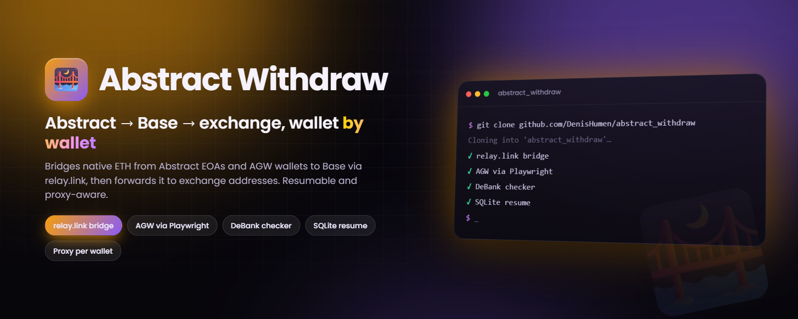
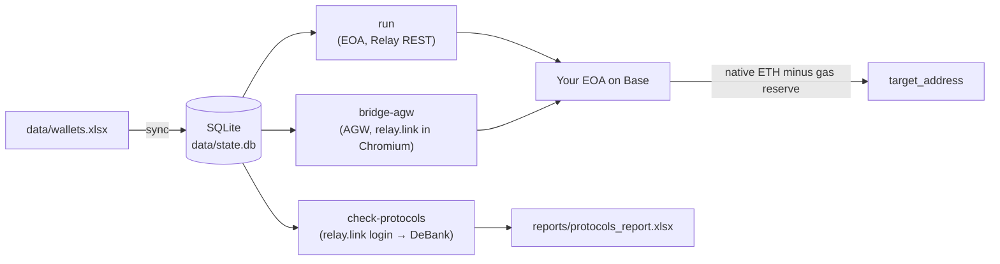

<div align="center">



# Abstract Withdraw

**Batch cross-chain withdrawal from Abstract to Base via relay.link — resumable, proxy-aware, driven by a single Excel sheet.**

[](#-quick-start)
[](https://web3py.readthedocs.io)
[](https://playwright.dev/python/)
[](#-tech-stack--architecture)
[](https://relay.link)
[](https://github.com/DenisHumen/abstract_withdraw/commits/main)

**English** · [Русский](README.ru.md)

[Features](#-features) · [Quick start](#-quick-start) · [Usage](#-usage) · [Configuration](#%EF%B8%8F-configuration) · [Security](#-security)

</div>

---

Abstract Withdraw is a Python CLI that moves funds out of many wallets on the **Abstract** network: it bridges them through **[relay.link](https://relay.link)** into **native ETH on Base**, then forwards the ETH to a target EVM address per wallet (for example, an exchange deposit address). It works both for plain EOAs (fully programmatic, via Relay's public REST API) and for **Abstract Global Wallet (AGW)** smart wallets (by driving the relay.link website in Chromium with a single private key). A separate checker reports which DeFi protocols each wallet uses, based on DeBank.

It is built for people who manage many wallets at once: every step is recorded in SQLite, so a crashed or interrupted run continues exactly where it stopped without resending transactions.

> [!NOTE]
> The CLI, log messages and in-code documentation are in **Russian**. Design notes live in [PLAN.md](PLAN.md); context for AI coding agents lives in [AGENTS.md](AGENTS.md) and [CLAUDE.md](CLAUDE.md).

## ✨ Features

| | |
|---|---|
| 🔁 **EOA pipeline** (`run`) | Pre-flight balances → Relay quote (`/quote/v2`) → approve/deposit on Abstract (EIP-1559, zero priority fee) → wait for the funds on Base → send the whole Base balance minus a gas reserve to `target_address`. |
| 🌉 **AGW browser bridge** (`bridge-agw`) | Logs in to relay.link as your AGW through Privy using only the private key, bridges **all native ETH** to your own EOA on Base, waits for it to arrive, then forwards it to the exchange address from the spreadsheet. |
| 🔎 **Protocol checker** (`check-protocols`) | Resolves each wallet's AGW address, opens its DeBank profile, captures the portfolio data and exports `reports/protocols_report.xlsx` (sheets `protocols`, `summary`, `catalog`). Multithreaded. |
| 📒 **Excel as the source of truth** | `data/wallets.xlsx` defines the wallet set. Rows added, removed or updated in the file are mirrored into SQLite on every run; an empty or unreadable file never wipes the database. |
| ⏳ **Wait for the target address** | A wallet without `target_address` is queued as `WAITING_TARGET` instead of failing. `bridge-agw` keeps re-reading the XLSX and sends the funds as soon as an address appears. |
| ♻️ **Idempotent and resumable** | Job state and every transaction hash live in `data/state.db`. Re-runs skip finished wallets, and sent-but-unconfirmed transactions are awaited rather than re-sent. |
| 🧦 **Per-wallet proxies** | HTTP proxies in `login:passwd@ip:port` format, taken from the XLSX or from a pool file, with health checks, sticky assignment and automatic rotation. Credentials are masked in logs. |
| 🆓 **No paid APIs** | Only the public Relay REST API, public RPC nodes and Multicall3 — no Etherscan, abscan or Relay API key. |
| 🧪 **Dry-run mode** | `--dry-run` quotes and plans everything without sending a single transaction (and without opening a browser for `bridge-agw`). |
| 🖥️ **Interactive menu** | Run without arguments to get a menu with every mode. |

## 🚀 Quick start

**Prerequisites:** Python 3.11+ and Chromium for Playwright (needed by `bridge-agw` and `check-protocols`).

```powershell
git clone https://github.com/DenisHumen/abstract_withdraw.git
cd abstract_withdraw

python -m venv .venv
.\.venv\Scripts\pip install -r requirements.txt
.\.venv\Scripts\python -m playwright install chromium

# 1) create data/wallets.xlsx, data/proxies.txt and .env from templates
.\.venv\Scripts\python -m src.main init-data

# 2) fill in data/wallets.xlsx (private_key, target_address, optional proxy)
#    and, if you use a proxy pool, data/proxies.txt — then delete the example row

# 3) check routes and amounts without sending anything
.\.venv\Scripts\python -m src.main run --dry-run

# 4) real run
.\.venv\Scripts\python -m src.main run
```

On macOS/Linux use `.venv/bin/pip` and `.venv/bin/python` instead. `python main.py <command>` is equivalent to `python -m src.main <command>`.

> [!CAUTION]
> This tool signs real transactions with real private keys. Always start with `--dry-run`, then test a single wallet with a small amount before running the whole list.

## 🧭 Usage

### Commands

| Command | What it does |
|---|---|
| *(no command)* | Interactive menu with all modes below |
| `init-data` | Create `data/wallets.xlsx`, `data/proxies.txt` and `.env` from templates (existing files are left alone) |
| `sync` | Mirror `data/wallets.xlsx` into SQLite (private keys are never written to the DB) |
| `discover [--wallet ADDR]` | Token discovery only, no transactions |
| `run [--dry-run] [--wallet ADDR]` | EOA pipeline: Abstract → Relay → Base → `target_address` |
| `bridge-agw [--dry-run] [--wallet ADDR]` | Browser bridge: native ETH from the AGW → your EOA on Base → exchange address |
| `check-protocols [-t N] [-l N] [--wallet ADDR]` | Protocol checker (relay.link login → AGW address → DeBank → Excel report) |
| `report-protocols` | Regenerate `reports/protocols_report.xlsx` from the database |
| `status` | Progress table for bridge jobs plus a checker summary |
| `retry [--wallet ADDR]` | Reset `FAILED` jobs and run the EOA pipeline again |

Every command except `init-data` accepts `--config PATH` to use another `config.yaml`. `check-protocols` also supports `--no-headless` (show the DeBank browser) and `--no-report` (skip the Excel export).

```powershell
.\.venv\Scripts\python -m src.main                              # interactive menu
.\.venv\Scripts\python -m src.main status                       # progress
.\.venv\Scripts\python -m src.main retry                        # re-run failed jobs

.\.venv\Scripts\python -m src.main bridge-agw --dry-run         # plan only: no browser, no transactions
.\.venv\Scripts\python -m src.main bridge-agw                   # real run

.\.venv\Scripts\python -m src.main check-protocols              # thread counts from config.yaml
.\.venv\Scripts\python -m src.main check-protocols --threads 4  # 4 DeBank threads
.\.venv\Scripts\python -m src.main check-protocols -t 4 -l 3    # + 3 relay.link login threads
.\.venv\Scripts\python -m src.main report-protocols             # rebuild the Excel report from the DB
```

### EOA pipeline (`run`)

```text
XLSX → sync → SQLite
for each wallet (in parallel, through its own proxy):
  PREFLIGHT  native balances on Abstract and Base (public RPC)
  DISCOVER   native ETH only (default), or Relay /currencies/v1 ∩ Multicall3 balanceOf
  per token (ERC-20 first, native ETH last):
    QUOTE     POST /quote/v2, recipient = your own address on Base; dust / no route → SKIPPED
    APPROVE   if Relay returns an approve step (ERC-20)
    DEPOSIT   sign and send the deposit tx on Abstract
    BRIDGE    wait for the Base balance to grow (RPC, source of truth) + intents/status/v3
    TRANSFER  whole Base balance minus gas reserve → target_address
```

Job statuses: `PENDING → DISCOVERED → QUOTED → APPROVED → DEPOSITED → BRIDGED → TRANSFERRED → DONE`; waiting: `WAITING_TARGET`; special: `FAILED`, `SKIPPED`, `REFUNDED`, `NEEDS_BROWSER`.

In this mode a wallet **without** `target_address` performs **no on-chain actions at all**: its jobs sit in `WAITING_TARGET` and resume on the next `run` once the address is in the XLSX.

### AGW browser bridge (`bridge-agw`)

Funds held in an Abstract Global Wallet are controlled by Privy's embedded signer, not by your key directly, so this mode drives the relay.link website. Only **native ETH** is bridged. For each wallet, one at a time:

1. **Log in and bridge.** A headful Chromium window opens relay.link, logs in through Privy with your key, sets *Buy* = ETH on **Base**, pastes **your own EVM address derived from `private_key`** as the recipient, then clicks MAX → Swap → Approve.
2. **Watch Base.** The tool waits until the ETH actually arrives on that address (balance via public RPC).
3. **Send to the exchange.** If `target_address` is set, the whole balance minus a gas reserve is sent there. If it is empty, the wallet enters `WAITING_TARGET` and the tool re-reads the XLSX every `execution.target_poll_interval_sec` seconds (30 by default), sending as soon as the address appears. Pressing Ctrl+C is safe — the next run continues from the same point.

Re-runs are idempotent: `DONE` wallets are skipped, already-bridged wallets go straight to the transfer, sent-but-unconfirmed transfers are awaited instead of re-sent, and an AGW that has already been emptied is not bridged again. `bridge-agw` does not retry `FAILED` wallets on its own: reset them with `retry` (which also runs the EOA pipeline), then start `bridge-agw` again.

### Protocol checker (`check-protocols`)

Each wallet gets two tasks in the `check_tasks` table (`PENDING` / `RUNNING` / `DONE` / `FAILED`):

1. **`get_agw`** — log in to relay.link with your key to obtain the AGW (Privy) address and cache it in the DB. Skipped when the address is already known from the DB or the `agw_address` column.
2. **`check_protocols`** — open `debank.com/profile/<agw>`, capture the portfolio responses and store protocols and positions.

As soon as an address is obtained it is checked on DeBank. A failed login marks both tasks `FAILED`. The browser uses the wallet's proxy. At the end the tool saves `reports/protocols_report.xlsx` (sheets `protocols` / `summary` / `catalog`, with wallets visually separated) and prints a task summary — for large wallet lists, only totals and problem rows.

Two independent thread settings control concurrency:

| Option | Config key | Default | Notes |
|---|---|---|---|
| `--threads` / `-t` | `execution.check_concurrency` | 3 | DeBank checks, headless and light |
| `--login-threads` / `-l` | `execution.login_concurrency` | 2 | relay.link logins — each is a full **headful** Chromium window |

> [!TIP]
> Too many login threads overload the machine and logins start failing (the wallet modal does not load within 60 s). Start with 2–3 and drop to 1 if logins fail en masse. Re-runs where addresses are already cached need no logins and are fully parallel. Every login attempt uses a fresh browser profile, so Cloudflare cookies do not carry over between attempts.

## ⚙️ Configuration

### `data/wallets.xlsx`

| Column | Required | Description |
|---|---|---|
| `address` | no | EOA address; if set, it must match the address derived from the key, otherwise the row is skipped |
| `private_key` | **yes** | EVM private key (`0x` prefix is added if missing) |
| `target_address` | no | Where to send the ETH on Base. **Empty → the job is queued as `WAITING_TARGET`** and continues once the address appears |
| `agw_address` | no | AGW / Privy address. **If set, the checker skips the relay.link login** and goes straight to DeBank (fast, parallel) |
| `proxy` | no | `login:passwd@ip:port`; if empty, a proxy from `data/proxies.txt` is used |
| `adspower_profile` | no | AdsPower profile ID (reserved for a future fallback) |
| `label` | no | Free-form label |
| `enabled` | no | `1` / `0` (default `1`; `0`, `false`, `no`, `нет` disable the row) |

**Two-way sync.** On every `sync` / `run` (and the other commands that read the sheet), the database is brought in line with the file: new rows are added, **removed rows are deleted from the DB together with their jobs, balances and logs**, and a newly filled `target_address` releases `WAITING_TARGET` jobs. If the XLSX has no valid wallets, nothing is deleted.

### `.env`

| Variable | Default | Description |
|---|---|---|
| `ABSTRACT_RPC_URLS` | `https://api.mainnet.abs.xyz` | Comma-separated public Abstract RPCs; the first is primary, the rest are used for rotation |
| `BASE_RPC_URLS` | `https://mainnet.base.org` | Comma-separated public Base RPCs (`.env.example` lists three) |
| `ADSPOWER_API_KEY` | *(empty)* | Reserved for a future AdsPower fallback; not used by the current code |
| `ADSPOWER_BASE_URL` | `http://local.adspower.net:50325` | Same as above |
| `WALLET_ENCRYPTION_KEY` | *(empty)* | Reserved; not used — keys are never stored in the DB |

### `config.yaml`

Run parameters (no secrets), commented inline. Highlights:

<details>
<summary><b>Key settings</b></summary>

| Key | Default | Description |
|---|---|---|
| `mode.dry_run` | `false` | Force dry-run for every command |
| `routing.origin_chain_id` / `dest_chain_id` | `2741` / `8453` | Abstract → Base |
| `routing.slippage_bps` | `50` | Relay slippage in basis points |
| `amounts.gas_estimate_multiplier` | `1.5` | Multiplier for the dynamic gas-reserve estimate |
| `amounts.gas_reserve_abstract_floor_wei` | `0.0003 ETH` | Minimum gas reserve kept on Abstract |
| `amounts.gas_reserve_base_floor_wei` | `0.0001 ETH` | Minimum gas reserve for the final transfer on Base |
| `amounts.min_native_out_wei` | `0.0002 ETH` | Quotes with a smaller output are `SKIPPED` as dust |
| `execution.concurrency` | `3` | Wallets processed in parallel by `run` |
| `execution.check_concurrency` / `login_concurrency` | `3` / `2` | Checker threads (see above) |
| `execution.login_proxy_tries` | `8` | Proxies to try for a relay.link login (Cloudflare blocks some) |
| `execution.status_timeout_sec` | `900` | How long to wait for a bridge to land |
| `execution.wallet_delay_sec` / `login_delay_sec` | `[3, 10]` / `[15, 30]` | Random pauses between wallets / between logins in one thread |
| `execution.target_poll_interval_sec` | `30` | How often `bridge-agw` re-reads the XLSX while waiting for an address |
| `rpc.*`, `retry.*` | — | RPC rotation, timeouts and retry backoff |
| `proxy.*` | enabled | Pool file, per-wallet proxy from XLSX, health check against `api.relay.link`, rotation, sticky assignment |
| `tokens.native_only` | `true` | Bridge native ETH only; set `false` to discover and bridge ERC-20 tokens in `run` |
| `tokens.verified_only`, `allowlist`, `denylist` | `false`, `[]`, `[]` | Token discovery filters |
| `paths.*` | `data/wallets.xlsx`, `data/state.db`, `logs` | File locations |

`mode.forward_mode`, `mode.use_browser_fallback`, `amounts.bridge_full_balance` and `execution.quote_ttl_sec` exist in the file but are not read by the current code.

</details>

## 🔒 Security

What the code does with your secrets, and what you should do:

- **Private keys live in `data/wallets.xlsx` as plain text.** They are loaded into process memory for the duration of a run and are never written to SQLite or the logs. Keep the file on an encrypted disk and delete it when you are done.
- `.gitignore` excludes `.env`, `data/wallets.xlsx`, `data/proxies.txt`, `data/state.db`, `data/.browser/`, `logs/` and `reports/protocols_report.xlsx`. Never commit them.
- Proxy credentials are masked in logs (`***@ip:port`). Logs (`logs/run-YYYYMMDD.jsonl`) and the database do contain wallet and target addresses.
- In `bridge-agw` and `check-protocols` the tool injects its own wallet provider into the automated Chromium window. It **signs `personal_sign` / `eth_signTypedData` requests from pages in that window automatically**, without asking. Do not use that window for anything else.
- Browser profiles are created fresh for every login attempt under `data/.browser/` and deleted afterwards.
- Always run `--dry-run` first, then test one wallet with a small amount.

## 🧱 Tech stack / Architecture

- **Python 3.11+**, `web3.py` v7 + `eth-account`, `httpx`, `tenacity`
- **Typer** + **Rich** CLI, JSONL file logs
- **SQLite** state (`data/state.db`), **openpyxl** for XLSX input and reports
- **Playwright** (Chromium) for relay.link / Privy and DeBank
- Optional: `zksync2` for an EIP-712 (type-113) fallback on Abstract if a standard transaction is rejected



## 📁 Project structure

```text
.
├── main.py                 # Entry point: python main.py <command>
├── config.yaml             # Run parameters (no secrets)
├── .env.example            # RPC pools, reserved AdsPower settings
├── requirements.txt
├── PLAN.md                 # Architecture and design notes (RU)
├── AGENTS.md, CLAUDE.md    # Context for AI coding agents (RU)
└── src/
    ├── main.py             # Typer CLI and interactive menu
    ├── config.py           # .env + config.yaml loading
    ├── logger.py           # Rich console + JSONL logs
    ├── browser/            # Injected wallet provider, relay.link automation (Playwright)
    ├── chains/             # EVM / Abstract / Base clients, Multicall3, token discovery
    ├── core/               # pipeline, steps, AGW bridge, protocol checker, errors
    ├── data_io/            # XLSX read/sync/template, protocol report export
    ├── db/                 # schema.sql, DAO, models and statuses
    ├── debank/             # DeBank response parsing
    ├── net/                # Proxy pool and RPC pool
    └── relay/              # Relay REST client and types
```

Runtime folders created by the tool: `data/` (wallets, proxies, database, browser profiles), `logs/`, `reports/`.

## 🗺 Roadmap

From the open items in [PLAN.md](PLAN.md) and [CLAUDE.md](CLAUDE.md):

- [ ] Extend the AGW browser bridge beyond native ETH (ERC-20 tokens)
- [ ] AdsPower-based browser fallback (`ADSPOWER_*`, `adspower_profile`)

## 🤝 Contributing

Issues and pull requests are welcome. Please test changes with `--dry-run` and keep [PLAN.md](PLAN.md) and the agent notes in sync with the code.

## 📄 License

License: not specified yet.
