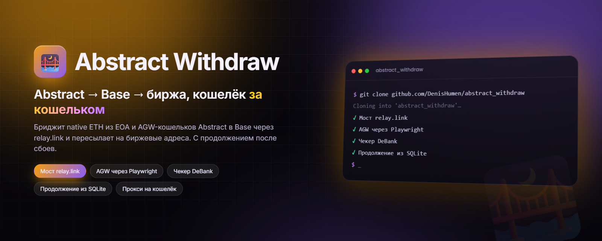
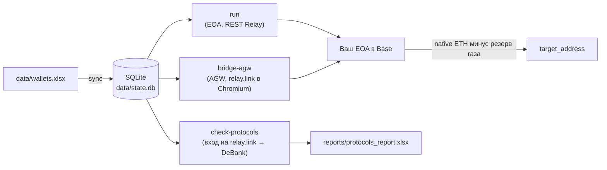

<div align="center">



# Abstract Withdraw

**Массовый кроссчейн-вывод из Abstract в Base через relay.link — с продолжением после сбоев, прокси на кошелёк и управлением из одной Excel-таблицы.**

[](#-быстрый-старт)
[](https://web3py.readthedocs.io)
[](https://playwright.dev/python/)
[](#-стек-и-архитектура)
[](https://relay.link)
[](https://github.com/DenisHumen/abstract_withdraw/commits/main)

[English](README.md) · **Русский**

[Возможности](#-возможности) · [Быстрый старт](#-быстрый-старт) · [Использование](#-использование) · [Настройка](#%EF%B8%8F-настройка) · [Безопасность](#-безопасность)

</div>

---

Abstract Withdraw — CLI на Python для вывода средств с множества кошельков в сети **Abstract**: он бриджит их через **[relay.link](https://relay.link)** в **native ETH на Base**, а затем пересылает ETH на целевой EVM-адрес каждого кошелька (например, депозитный адрес биржи). Поддерживаются как обычные EOA (полностью программно, через публичный REST API Relay), так и смарт-кошельки **Abstract Global Wallet (AGW)** — через автоматизацию сайта relay.link в Chromium одним приватным ключом. Отдельный чекер по данным DeBank показывает, какими DeFi-протоколами пользуется каждый кошелёк.

Инструмент рассчитан на работу с большим числом кошельков: каждый шаг фиксируется в SQLite, поэтому упавший или прерванный запуск продолжается ровно с того места, где остановился, и не отправляет транзакции повторно.

> [!NOTE]
> CLI, логи и комментарии в коде — на **русском**. Архитектура и детальный план — в [PLAN.md](PLAN.md); контекст для ИИ-агентов — в [AGENTS.md](AGENTS.md) и [CLAUDE.md](CLAUDE.md).

## ✨ Возможности

| | |
|---|---|
| 🔁 **EOA-пайплайн** (`run`) | Проверка балансов → квота Relay (`/quote/v2`) → approve/deposit в Abstract (EIP-1559, нулевой priority fee) → ожидание средств на Base → отправка всего баланса Base за вычетом резерва на газ на `target_address`. |
| 🌉 **Браузерный мост для AGW** (`bridge-agw`) | Входит на relay.link как ваш AGW через Privy, используя только приватный ключ, бриджит **весь native ETH** на ваш собственный EOA в Base, ждёт зачисления и пересылает его на биржевой адрес из таблицы. |
| 🔎 **Чекер протоколов** (`check-protocols`) | Определяет AGW-адрес каждого кошелька, открывает его профиль на DeBank, перехватывает данные портфеля и выгружает `reports/protocols_report.xlsx` (листы `protocols`, `summary`, `catalog`). Многопоточный. |
| 📒 **Excel — источник истины** | Набор кошельков задаёт `data/wallets.xlsx`. Добавленные, удалённые и изменённые строки при каждом запуске отражаются в SQLite; пустой или нечитаемый файл никогда не обнуляет базу. |
| ⏳ **Ожидание целевого адреса** | Кошелёк без `target_address` не падает, а встаёт в очередь `WAITING_TARGET`. `bridge-agw` перечитывает XLSX и отправляет средства, как только адрес появится. |
| ♻️ **Идемпотентность и продолжение** | Статусы задач и хэши всех транзакций хранятся в `data/state.db`. При повторном запуске готовые кошельки пропускаются, а отправленные, но неподтверждённые транзакции дожидаются, а не шлются заново. |
| 🧦 **Прокси на кошелёк** | HTTP-прокси формата `login:passwd@ip:port` из XLSX или из файла-пула, с health-check, закреплением за кошельком и автоматической ротацией. Креды в логах маскируются. |
| 🆓 **Без платных API** | Только публичный REST API Relay, публичные RPC-ноды и Multicall3 — ключи Etherscan, abscan или Relay не нужны. |
| 🧪 **Режим dry-run** | `--dry-run` считает квоты и строит план, не отправляя ни одной транзакции (а для `bridge-agw` — даже не открывая браузер). |
| 🖥️ **Интерактивное меню** | Запуск без аргументов открывает меню со всеми режимами. |

## 🚀 Быстрый старт

**Что нужно:** Python 3.11+ и Chromium для Playwright (нужен для `bridge-agw` и `check-protocols`).

```powershell
git clone https://github.com/DenisHumen/abstract_withdraw.git
cd abstract_withdraw

python -m venv .venv
.\.venv\Scripts\pip install -r requirements.txt
.\.venv\Scripts\python -m playwright install chromium

# 1) создать шаблоны data/wallets.xlsx, data/proxies.txt и .env
.\.venv\Scripts\python -m src.main init-data

# 2) заполнить data/wallets.xlsx (private_key, target_address, опц. proxy)
#    и при необходимости data/proxies.txt (пул прокси для ротации), затем удалить строку-пример

# 3) проверить маршруты и суммы без отправки транзакций
.\.venv\Scripts\python -m src.main run --dry-run

# 4) боевой запуск
.\.venv\Scripts\python -m src.main run
```

На macOS/Linux используйте `.venv/bin/pip` и `.venv/bin/python`. Команда `python main.py <команда>` эквивалентна `python -m src.main <команда>`.

> [!CAUTION]
> Инструмент подписывает настоящие транзакции настоящими приватными ключами. Всегда начинайте с `--dry-run`, затем проверьте один кошелёк на малой сумме и только потом запускайте весь список.

## 🧭 Использование

### Команды

| Команда | Что делает |
|---|---|
| *(без команды)* | Интерактивное меню со всеми режимами ниже |
| `init-data` | Создаёт `data/wallets.xlsx`, `data/proxies.txt` и `.env` из шаблонов (существующие файлы не трогает) |
| `sync` | Синхронизирует `data/wallets.xlsx` → SQLite (приватные ключи в БД не пишутся) |
| `discover [--wallet ADDR]` | Только поиск токенов, без транзакций |
| `run [--dry-run] [--wallet ADDR]` | EOA-пайплайн: Abstract → Relay → Base → `target_address` |
| `bridge-agw [--dry-run] [--wallet ADDR]` | Браузерный мост: native ETH из AGW → ваш EOA в Base → биржевой адрес |
| `check-protocols [-t N] [-l N] [--wallet ADDR]` | Чекер протоколов (вход на relay.link → AGW-адрес → DeBank → Excel-отчёт) |
| `report-protocols` | Перегенерировать `reports/protocols_report.xlsx` из БД |
| `status` | Таблица прогресса по мосту и сводка чекера |
| `retry [--wallet ADDR]` | Сбросить `FAILED`-задачи и заново запустить EOA-пайплайн |

Все команды, кроме `init-data`, принимают `--config ПУТЬ` для другого `config.yaml`. У `check-protocols` есть ещё `--no-headless` (показать браузер DeBank) и `--no-report` (не сохранять Excel).

```powershell
.\.venv\Scripts\python -m src.main                              # интерактивное меню
.\.venv\Scripts\python -m src.main status                       # прогресс
.\.venv\Scripts\python -m src.main retry                        # перезапуск упавших

.\.venv\Scripts\python -m src.main bridge-agw --dry-run         # только план: без браузера и транзакций
.\.venv\Scripts\python -m src.main bridge-agw                   # боевой запуск

.\.venv\Scripts\python -m src.main check-protocols              # число потоков из config.yaml
.\.venv\Scripts\python -m src.main check-protocols --threads 4  # DeBank-проверки в 4 потока
.\.venv\Scripts\python -m src.main check-protocols -t 4 -l 3    # + входы на relay.link в 3 потока
.\.venv\Scripts\python -m src.main report-protocols             # пересобрать Excel-отчёт из БД
```

### EOA-пайплайн (`run`)

```text
XLSX → sync → SQLite
для каждого кошелька (параллельно, через свой прокси):
  PREFLIGHT  балансы native ETH в Abstract и Base (публичный RPC)
  DISCOVER   только native ETH (по умолчанию) или Relay /currencies/v1 ∩ Multicall3 balanceOf
  на каждый токен (ERC-20 сначала, native ETH последним):
    QUOTE     POST /quote/v2, получатель = ваш же адрес в Base; пыль / нет маршрута → SKIPPED
    APPROVE   если Relay вернул шаг approve (ERC-20)
    DEPOSIT   подпись и отправка deposit-транзакции в Abstract
    BRIDGE    ожидание роста баланса в Base (RPC — источник истины) + intents/status/v3
    TRANSFER  весь баланс Base минус резерв газа → target_address
```

Статусы задачи: `PENDING → DISCOVERED → QUOTED → APPROVED → DEPOSITED → BRIDGED → TRANSFERRED → DONE`; ожидание: `WAITING_TARGET`; особые: `FAILED`, `SKIPPED`, `REFUNDED`, `NEEDS_BROWSER`.

В этом режиме кошелёк **без** `target_address` **вообще не совершает ончейн-действий**: его задачи ждут в `WAITING_TARGET` и продолжатся при следующем `run`, когда адрес появится в XLSX.

### Браузерный мост для AGW (`bridge-agw`)

Средствами в Abstract Global Wallet управляет встроенный подписант Privy, а не ваш ключ напрямую, поэтому этот режим работает через сайт relay.link. Бриджится только **native ETH**. Для каждого кошелька по очереди:

1. **Вход и мост.** Открывается окно Chromium (headful) с relay.link, вход выполняется через Privy вашим ключом, выставляется *Buy* = ETH в сети **Base**, получателем вставляется **ваш собственный EVM-адрес, выведенный из `private_key`**, затем MAX → Swap → Approve.
2. **Мониторинг Base.** Скрипт ждёт фактического зачисления ETH на этот адрес (баланс по публичному RPC).
3. **Отправка на биржу.** Если `target_address` задан, весь баланс за вычетом резерва на газ уходит туда. Если пуст — кошелёк переходит в `WAITING_TARGET`, а скрипт перечитывает XLSX каждые `execution.target_poll_interval_sec` секунд (по умолчанию 30) и отправляет средства, как только адрес появится. Ctrl+C безопасен — следующий запуск продолжит с того же места.

Повторный запуск идемпотентен: кошельки в `DONE` пропускаются, уже сбридженные сразу переходят к отправке, отправленные, но неподтверждённые переводы дожидаются, а не шлются заново, а уже опустошённый AGW повторно не бриджится. Сам `bridge-agw` не повторяет кошельки в `FAILED`: сбросьте их командой `retry` (она также запускает EOA-пайплайн) и снова запустите `bridge-agw`.

### Чекер протоколов (`check-protocols`)

На каждый кошелёк в таблице `check_tasks` заводятся две задачи (`PENDING` / `RUNNING` / `DONE` / `FAILED`):

1. **`get_agw`** — вход на relay.link вашим ключом, чтобы получить AGW/Privy-адрес и закэшировать его в БД. Пропускается, если адрес уже известен из БД или колонки `agw_address`.
2. **`check_protocols`** — открыть `debank.com/profile/<agw>`, перехватить данные портфеля и сохранить протоколы и позиции.

Получили адрес — **сразу же** проверяем его на DeBank. Провал входа помечает обе задачи `FAILED`. Браузер ходит через прокси кошелька. В конце сохраняется `reports/protocols_report.xlsx` (листы `protocols` / `summary` / `catalog`, кошельки визуально разделены) и печатается сводка по задачам — на большом числе кошельков только итоги и проблемные строки.

Параллельность задают два независимых параметра:

| Опция | Ключ конфига | По умолчанию | Примечание |
|---|---|---|---|
| `--threads` / `-t` | `execution.check_concurrency` | 3 | Проверки DeBank, headless и лёгкие |
| `--login-threads` / `-l` | `execution.login_concurrency` | 2 | Входы на relay.link — каждый это полноценное окно Chromium (**headful**) |

> [!TIP]
> Слишком много потоков входа перегружают машину, и входы начинают падать (модалка кошельков не грузится за 60 с). Начните с 2–3, а если входы массово падают — уменьшите до 1. Повторные прогоны, где адреса уже есть в БД, входа не требуют и полностью параллельны. Каждая попытка входа идёт со свежим профилем браузера, поэтому куки Cloudflare между попытками не переносятся.

## ⚙️ Настройка

### `data/wallets.xlsx`

| Колонка | Обяз. | Описание |
|---|---|---|
| `address` | нет | Адрес EOA; если задан, должен совпадать с адресом из ключа, иначе строка пропускается |
| `private_key` | **да** | Приватный ключ EVM-кошелька (префикс `0x` добавляется, если его нет) |
| `target_address` | нет | Куда пересылать ETH в Base. **Пусто → задача встаёт в очередь `WAITING_TARGET`** и продолжится, когда адрес появится |
| `agw_address` | нет | AGW/Privy-адрес. **Если задан, чекер пропускает вход на relay.link** и сразу идёт на DeBank (быстро, параллельно) |
| `proxy` | нет | `login:passwd@ip:port`; если пусто — берётся из `data/proxies.txt` |
| `adspower_profile` | нет | ID профиля AdsPower (зарезервировано под будущую fallback-ветку) |
| `label` | нет | Произвольная метка |
| `enabled` | нет | `1` / `0` (по умолчанию `1`; `0`, `false`, `no`, `нет` отключают строку) |

**Двусторонняя синхронизация.** При каждом `sync` / `run` (и других командах, читающих таблицу) база приводится в соответствие с файлом: новые строки добавляются, **удалённые строки удаляются из БД вместе с их задачами, балансами и логами**, а заполненный позже `target_address` возобновляет задачи из `WAITING_TARGET`. Если в XLSX нет ни одного валидного кошелька, удаление не выполняется.

### `.env`

| Переменная | По умолчанию | Описание |
|---|---|---|
| `ABSTRACT_RPC_URLS` | `https://api.mainnet.abs.xyz` | Публичные RPC Abstract через запятую; первый — основной, остальные для ротации |
| `BASE_RPC_URLS` | `https://mainnet.base.org` | Публичные RPC Base через запятую (в `.env.example` указано три) |
| `ADSPOWER_API_KEY` | *(пусто)* | Зарезервировано под будущую fallback-ветку AdsPower; текущим кодом не используется |
| `ADSPOWER_BASE_URL` | `http://local.adspower.net:50325` | То же |
| `WALLET_ENCRYPTION_KEY` | *(пусто)* | Зарезервировано; не используется — ключи в БД не хранятся |

### `config.yaml`

Параметры запуска (без секретов) с комментариями прямо в файле. Основное:

<details>
<summary><b>Ключевые параметры</b></summary>

| Ключ | По умолчанию | Описание |
|---|---|---|
| `mode.dry_run` | `false` | Принудительный dry-run для всех команд |
| `routing.origin_chain_id` / `dest_chain_id` | `2741` / `8453` | Abstract → Base |
| `routing.slippage_bps` | `50` | Проскальзывание Relay в базисных пунктах |
| `amounts.gas_estimate_multiplier` | `1.5` | Множитель динамической оценки резерва на газ |
| `amounts.gas_reserve_abstract_floor_wei` | `0.0003 ETH` | Минимальный резерв на газ в Abstract |
| `amounts.gas_reserve_base_floor_wei` | `0.0001 ETH` | Минимальный резерв на финальный перевод в Base |
| `amounts.min_native_out_wei` | `0.0002 ETH` | Квоты с меньшим выходом считаются пылью → `SKIPPED` |
| `execution.concurrency` | `3` | Сколько кошельков `run` обрабатывает параллельно |
| `execution.check_concurrency` / `login_concurrency` | `3` / `2` | Потоки чекера (см. выше) |
| `execution.login_proxy_tries` | `8` | Сколько прокси перебрать для входа на relay.link (часть режет Cloudflare) |
| `execution.status_timeout_sec` | `900` | Сколько ждать завершения моста |
| `execution.wallet_delay_sec` / `login_delay_sec` | `[3, 10]` / `[15, 30]` | Случайные паузы между кошельками / между входами в одном потоке |
| `execution.target_poll_interval_sec` | `30` | Как часто `bridge-agw` перечитывает XLSX в ожидании адреса |
| `rpc.*`, `retry.*` | — | Ротация RPC, таймауты и паузы между повторами |
| `proxy.*` | включено | Файл пула, прокси из XLSX, health-check через `api.relay.link`, ротация, закрепление |
| `tokens.native_only` | `true` | Бриджить только native ETH; `false` — искать и бриджить ERC-20 в `run` |
| `tokens.verified_only`, `allowlist`, `denylist` | `false`, `[]`, `[]` | Фильтры поиска токенов |
| `paths.*` | `data/wallets.xlsx`, `data/state.db`, `logs` | Расположение файлов |

Ключи `mode.forward_mode`, `mode.use_browser_fallback`, `amounts.bridge_full_balance` и `execution.quote_ttl_sec` есть в файле, но текущим кодом не читаются.

</details>

## 🔒 Безопасность

Что код делает с вашими секретами и что стоит делать вам:

- **Приватные ключи хранятся в `data/wallets.xlsx` открытым текстом.** Они загружаются в память процесса на время запуска и никогда не пишутся в SQLite или логи. Держите файл на зашифрованном диске и удаляйте его после работы.
- `.gitignore` исключает `.env`, `data/wallets.xlsx`, `data/proxies.txt`, `data/state.db`, `data/.browser/`, `logs/` и `reports/protocols_report.xlsx`. Никогда не коммитьте эти файлы.
- Креды прокси в логах маскируются (`***@ip:port`). При этом логи (`logs/run-YYYYMMDD.jsonl`) и база содержат адреса кошельков и получателей.
- В `bridge-agw` и `check-protocols` скрипт внедряет в окно Chromium собственный провайдер кошелька. Он **автоматически, без подтверждения подписывает запросы `personal_sign` / `eth_signTypedData`** от страниц в этом окне. Не используйте это окно ни для чего другого.
- Профили браузера создаются заново для каждой попытки входа в `data/.browser/` и удаляются после неё.
- Всегда сначала `--dry-run`, затем тест на одном кошельке с малой суммой.

## 🧱 Стек и архитектура

- **Python 3.11+**, `web3.py` v7 + `eth-account`, `httpx`, `tenacity`
- CLI на **Typer** + **Rich**, логи в файл в формате JSONL
- Состояние в **SQLite** (`data/state.db`), **openpyxl** для входного XLSX и отчётов
- **Playwright** (Chromium) для relay.link / Privy и DeBank
- Опционально: `zksync2` для fallback-подписи EIP-712 (type-113) в Abstract, если стандартная транзакция отклонена



## 📁 Структура проекта

```text
.
├── main.py                 # Точка входа: python main.py <команда>
├── config.yaml             # Параметры запуска (без секретов)
├── .env.example            # RPC-пулы, зарезервированные настройки AdsPower
├── requirements.txt
├── PLAN.md                 # Архитектура и детальный план
├── AGENTS.md, CLAUDE.md    # Контекст для ИИ-агентов
└── src/
    ├── main.py             # CLI на Typer и интерактивное меню
    ├── config.py           # Загрузка .env + config.yaml
    ├── logger.py           # Консоль Rich + JSONL-логи
    ├── browser/            # Внедряемый провайдер кошелька, автоматизация relay.link (Playwright)
    ├── chains/             # Клиенты EVM / Abstract / Base, Multicall3, поиск токенов
    ├── core/               # Пайплайн, шаги, AGW-мост, чекер протоколов, ошибки
    ├── data_io/            # Чтение/синхронизация/шаблон XLSX, выгрузка отчёта
    ├── db/                 # schema.sql, DAO, модели и статусы
    ├── debank/             # Разбор ответов DeBank
    ├── net/                # Пулы прокси и RPC
    └── relay/              # REST-клиент Relay и типы
```

Рабочие папки, которые создаёт инструмент: `data/` (кошельки, прокси, база, профили браузера), `logs/`, `reports/`.

## 🗺 Дорожная карта

По открытым пунктам из [PLAN.md](PLAN.md) и [CLAUDE.md](CLAUDE.md):

- [ ] Расширить браузерный мост AGW за пределы native ETH (токены ERC-20)
- [ ] Браузерная fallback-ветка на AdsPower (`ADSPOWER_*`, `adspower_profile`)

## 🤝 Участие

Issues и pull request'ы приветствуются. Проверяйте изменения через `--dry-run` и держите [PLAN.md](PLAN.md) и заметки для агентов в актуальном состоянии.

## 📄 Лицензия

Лицензия пока не указана.
